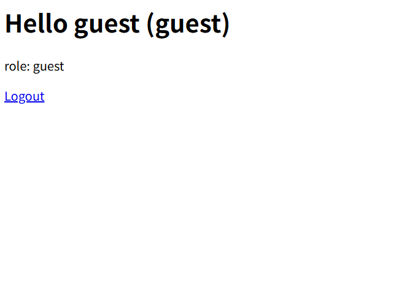

# I wanna be the Admin (Web)


## 問題
でもguestから始めよう!


<table align="center">
  <tr>
    <td>
      
    </td>
  </tr>
</table>

LoginとRegisterができるWebサービスです. 
RegisterされたuserでLoginすると以下のようなページが表示されます.

<table align="center">
  <tr>
    <td>
      
    </td>
  </tr>
</table>

## 解法
``` role=admin ```の```user```でLoginすれば```FLAG```が入手できるようです.

```js
app.get("/", auth, (req, res) => {
  const { username, role, nickname } = req.user;

  res.send(`
    <h1>Hello ${username} (${nickname ?? "no nickname"})</h1>
    <p>role: ${role}</p>
    ${role === "admin" ? `<p><b>${FLAG}</b></p>` : ""}
    <a href="/logout">Logout</a>
  `);
});
```

ソースコードを確認するとRegister処理で[スプレッド構文 (MDN Web Docs) ](https://developer.mozilla.org/ja/docs/Web/JavaScript/Reference/Operators/Spread_syntax)を使用している部分に問題がある. ```user_data```に```role: "admin"```が含まれていた場合, ```role: "guest"```が上書きされてしまう.


```js
const user_data = req.body

...

users.set(user_data.username, {
    role: "guest",
    ...user_data,
  });
```

Registerリクエストを編集して```role=admin```を含めてやれば```FLAG```が入手できる.